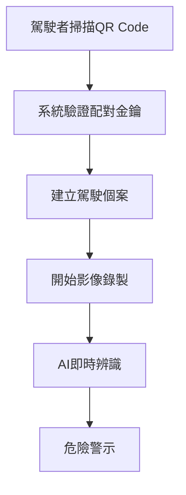
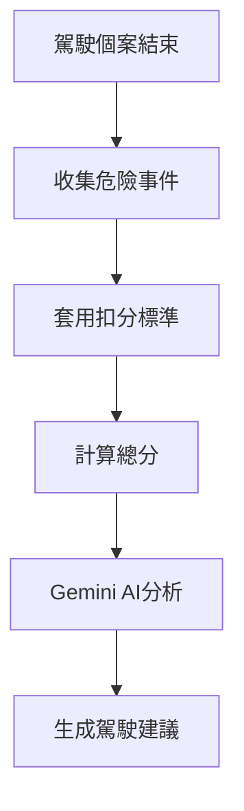

# 智慧行車紀錄器系統資料庫

## 🚗 專案概述

智慧行車紀錄器系統是一個集成 AI 影像辨識、危險警示與駕駛評分的邊緣運算解決方案。系統透過車載設備進行即時影像分析，結合後端資料處理與評分機制，提供完整的駕駛安全管理平台。

### 系統架構
- **紀錄器端**: 影像擷取、AI辨識、即時警示
- **資料處理端**: 資料上傳同步、群組管理、設備維護
- **平台端**: 評分計算、Gemini AI 分析、管理儀表板

## 📊 資料庫設計特色

### ✅ 符合資料庫正規化
- **1NF**: 所有欄位原子化，無重複群組
- **2NF**: 消除部分依賴，建立適當主外鍵關係  
- **3NF**: 消除傳遞依賴，建立標準化參考表

### 🎯 核心功能模組

#### 1. 駕駛個案管理
- 駕駛者與車輛配對機制
- 行程記錄與狀態追蹤
- QR Code 身份驗證

#### 2. 多鏡頭影像處理
- 車內/車外鏡頭數據儲存
- 原始影像檔案管理
- 串流影像處理記錄

#### 3. AI 辨識系統
- **物件辨識**: 車輛、行人、交通設施
- **車道線辨識**: 車道偏離、跨線檢測
- **交通號誌**: 紅綠燈、方向燈識別
- **駕駛狀態**: 疲勞、分心、情緒分析

#### 4. 危險事件偵測
- 即時危險警示
- 事件嚴重程度分級
- 地理位置與行駛數據記錄

#### 5. 評分系統 (精簡設計)
- 基礎分數 100 分制
- 危險事件扣分機制
- Gemini AI 駕駛建議

## 🗄️ 主要資料表結構

### 核心資料表
| 資料表名稱 | 用途 | 重要欄位 |
|-----------|------|---------|
| `drivers` | 駕駛者管理 | driver_id, full_name, employee_id |
| `vehicles` | 車輛資訊 | vehicle_id, license_plate, device_id |
| `vehicle_devices` | 車載設備 | device_id, device_serial, device_status |
| `driving_cases` | 駕駛個案 | case_id, driver_id, start_time, end_time |

### AI 辨識資料表
| 資料表名稱 | 用途 | 重要欄位 |
|-----------|------|---------|
| `object_detection_data` | 物件辨識 | object_type_id, confidence, bbox_* |
| `lane_detection_data` | 車道線辨識 | lane_type, deviation_distance |
| `traffic_light_data` | 交通號誌 | light_type, light_color, light_status |
| `facial_detection_data` | 臉部狀態 | drowsiness_level, attention_level |

### 評分系統資料表 (精簡版)
| 資料表名稱 | 用途 | 重要欄位 |
|-----------|------|---------|
| `deduction_criteria` | 扣分標準 | event_type_id, severity_id, deduction_points |
| `driving_case_scores` | 個案評分 | case_id, total_score, total_deductions |
| `score_details` | 扣分明細 | case_id, event_id, deduction_points |

### 參考資料表
| 資料表名稱 | 用途 | 資料範例 |
|-----------|------|---------|
| `event_types` | 事件類型 | 碰撞風險、車道偏離、疲勞駕駛 |
| `severity_levels` | 嚴重程度 | 低(1.0)、中(2.0)、高(3.5)、嚴重(5.0) |
| `object_types` | 物件類型 | 汽車、卡車、行人、交通號誌 |

## ⚡ 快速開始

### 1. 資料庫建立
```bash
# 連線到 MySQL
mysql -u root -p

# 執行建立腳本
source smart_dashcam_system.sql
```

### 2. 基本設定
```sql
-- 建立應用程式使用者
CREATE USER 'dashcam_app'@'localhost' IDENTIFIED BY 'your_password';
GRANT SELECT, INSERT, UPDATE ON smart_dashcam_system.* TO 'dashcam_app'@'localhost';

-- 建立唯讀使用者
CREATE USER 'dashcam_readonly'@'localhost' IDENTIFIED BY 'readonly_password';
GRANT SELECT ON smart_dashcam_system.* TO 'dashcam_readonly'@'localhost';
```

### 3. 測試資料插入
```sql
-- 建立測試群組
INSERT INTO groups (group_name, manager_id) VALUES ('測試群組', 1);

-- 建立測試駕駛者
INSERT INTO drivers (full_name, employee_id, group_id) VALUES ('張三', 'E001', 1);

-- 建立測試車輛
INSERT INTO vehicles (license_plate, vehicle_make, vehicle_model) VALUES ('ABC-1234', 'Toyota', 'Camry');
```

## 📈 核心功能使用

### 駕駛個案評分計算
```sql
-- 計算特定個案評分
CALL sp_calculate_driving_score(12345);

-- 查詢評分結果
SELECT * FROM driving_case_scores WHERE case_id = 12345;

-- 查詢扣分明細
SELECT 
    sd.deduction_points,
    et.event_name,
    sl.severity_name
FROM score_details sd
JOIN dangerous_events de ON sd.event_id = de.event_id
JOIN event_types et ON de.event_type_id = et.event_type_id
JOIN severity_levels sl ON de.severity_id = sl.severity_id
WHERE sd.case_id = 12345;
```

### 駕駛者績效查詢
```sql
-- 查詢駕駛者整體表現
SELECT * FROM v_driver_performance WHERE driver_id = 1;

-- 查詢群組績效排名
SELECT 
    g.group_name,
    AVG(dcs.total_score) as avg_group_score,
    COUNT(dc.case_id) as total_trips
FROM groups g
JOIN drivers d ON g.group_id = d.group_id
JOIN driving_cases dc ON d.driver_id = dc.driver_id
JOIN driving_case_scores dcs ON dc.case_id = dcs.case_id
GROUP BY g.group_id, g.group_name
ORDER BY avg_group_score DESC;
```

### 危險事件統計
```sql
-- 查詢最近 30 天危險事件
SELECT 
    et.event_name,
    sl.severity_name,
    COUNT(*) as event_count
FROM dangerous_events de
JOIN event_types et ON de.event_type_id = et.event_type_id
JOIN severity_levels sl ON de.severity_id = sl.severity_id
WHERE de.start_timestamp >= DATE_SUB(NOW(), INTERVAL 30 DAY)
GROUP BY et.event_name, sl.severity_name
ORDER BY event_count DESC;
```

## 🔧 系統維護

### 資料庫優化
```sql
-- 重建索引
ANALYZE TABLE driving_cases, dangerous_events, object_detection_data;

-- 清理過期配對金鑰
DELETE FROM driver_pairing_keys WHERE expires_at < NOW() AND token_status = 'expired';

-- 檢查資料庫大小
SELECT 
    table_name,
    ROUND(((data_length + index_length) / 1024 / 1024), 2) AS "Size (MB)"
FROM information_schema.tables 
WHERE table_schema = 'smart_dashcam_system'
ORDER BY (data_length + index_length) DESC;
```

### 備份與還原
```bash
# 備份資料庫
mysqldump -u root -p smart_dashcam_system > backup_$(date +%Y%m%d).sql

# 還原資料庫
mysql -u root -p smart_dashcam_system < backup_20250101.sql
```

## 📊 重要視圖說明

### v_driving_case_details
完整的駕駛個案資訊，包含駕駛者、車輛、設備和評分資料。

### v_dangerous_event_summary  
危險事件統計摘要，按嚴重程度分類統計。

### v_driver_performance
駕駛者績效統計，包含平均分數、總扣分、危險事件數量等。

## 🚀 效能優化建議

### 索引使用
- 查詢條件經常使用的欄位已建立索引
- 複合索引優化多欄位查詢
- 外鍵自動建立索引提升 JOIN 效能

### 查詢優化
- 使用預存程序封裝複雜計算邏輯
- 利用視圖簡化常用查詢
- 避免全表掃描，善用 WHERE 條件

### 資料管理
- 定期清理過期暫存資料
- 建立資料歸檔策略
- 監控資料庫成長趨勢

## 🔐 安全性考量

### 資料保護
- 駕駛者個人資料加密儲存
- 影像檔案路徑不直接暴露
- 配對金鑰有時效性限制

### 存取控制  
- 分離應用程式與管理員權限
- 唯讀帳號供報表查詢使用
- 敏感操作記錄操作日誌

### 資料完整性
- 外鍵約束確保資料一致性
- CHECK 約束驗證資料範圍
- 觸發器自動維護統計資料

## 🔍 常見查詢範例

### 1. 即時監控儀表板
```sql
-- 今日活躍駕駛數量
SELECT COUNT(DISTINCT driver_id) as active_drivers
FROM driving_cases 
WHERE DATE(start_time) = CURDATE() AND case_status = 'active';

-- 今日危險事件統計
SELECT 
    sl.severity_name,
    COUNT(*) as event_count
FROM dangerous_events de
JOIN severity_levels sl ON de.severity_id = sl.severity_id
WHERE DATE(de.start_timestamp) = CURDATE()
GROUP BY sl.severity_id, sl.severity_name;

-- 設備在線狀態
SELECT 
    network_status,
    COUNT(*) as device_count,
    ROUND(COUNT(*) * 100.0 / (SELECT COUNT(*) FROM vehicle_devices), 2) as percentage
FROM vehicle_devices
GROUP BY network_status;
```

### 2. 駕駛行為分析
```sql
-- 最常發生的危險事件類型
SELECT 
    et.event_name,
    COUNT(*) as frequency,
    AVG(de.confidence_score) as avg_confidence
FROM dangerous_events de
JOIN event_types et ON de.event_type_id = et.event_type_id
WHERE de.start_timestamp >= DATE_SUB(NOW(), INTERVAL 7 DAY)
GROUP BY et.event_type_id, et.event_name
ORDER BY frequency DESC
LIMIT 10;

-- 疲勞駕駛時段分析
SELECT 
    HOUR(de.start_timestamp) as hour_of_day,
    COUNT(*) as drowsy_events
FROM dangerous_events de
JOIN event_types et ON de.event_type_id = et.event_type_id
WHERE et.event_code = 'DROWSY_DRIVING'
AND de.start_timestamp >= DATE_SUB(NOW(), INTERVAL 30 DAY)
GROUP BY HOUR(de.start_timestamp)
ORDER BY hour_of_day;
```

### 3. 績效評估報表
```sql
-- 月度駕駛者排名
SELECT 
    d.full_name,
    d.employee_id,
    COUNT(dc.case_id) as trips_count,
    AVG(dcs.total_score) as avg_score,
    SUM(dcs.total_deductions) as total_deductions
FROM drivers d
JOIN driving_cases dc ON d.driver_id = dc.driver_id
JOIN driving_case_scores dcs ON dc.case_id = dcs.case_id
WHERE dc.start_time >= DATE_SUB(CURDATE(), INTERVAL 1 MONTH)
AND dc.case_status = 'completed'
GROUP BY d.driver_id, d.full_name, d.employee_id
HAVING trips_count >= 5  -- 至少5趟行程
ORDER BY avg_score DESC, total_deductions ASC
LIMIT 20;

-- 群組績效比較
SELECT 
    g.group_name,
    COUNT(DISTINCT d.driver_id) as active_drivers,
    COUNT(dc.case_id) as total_trips,
    AVG(dcs.total_score) as avg_group_score,
    SUM(des.critical_events) as total_critical_events
FROM groups g
JOIN drivers d ON g.group_id = d.group_id
JOIN driving_cases dc ON d.driver_id = dc.driver_id
JOIN driving_case_scores dcs ON dc.case_id = dcs.case_id
JOIN v_dangerous_event_summary des ON dc.case_id = des.case_id
WHERE dc.start_time >= DATE_SUB(CURDATE(), INTERVAL 3 MONTH)
GROUP BY g.group_id, g.group_name
ORDER BY avg_group_score DESC;
```

### 4. 設備管理查詢
```sql
-- 設備健康狀態檢查
SELECT 
    vd.device_serial,
    vd.device_status,
    vd.network_status,
    vd.battery_level,
    ROUND(vd.storage_used * 100.0 / vd.storage_capacity, 2) as storage_usage_percent,
    v.license_plate
FROM vehicle_devices vd
LEFT JOIN vehicles v ON vd.device_id = v.device_id
WHERE vd.device_status != 'inactive'
ORDER BY storage_usage_percent DESC;

-- 需要維護的設備
SELECT 
    vd.device_serial,
    vd.last_maintenance,
    DATEDIFF(CURDATE(), vd.last_maintenance) as days_since_maintenance,
    vd.battery_level,
    v.license_plate
FROM vehicle_devices vd
LEFT JOIN vehicles v ON vd.device_id = v.device_id
WHERE (
    vd.last_maintenance IS NULL 
    OR DATEDIFF(CURDATE(), vd.last_maintenance) > 90
    OR vd.battery_level < 20
)
AND vd.device_status = 'active'
ORDER BY days_since_maintenance DESC;
```

## 🔄 資料流程說明

### 1. 駕駛開始流程


### 2. 評分計算流程  


## 📋 資料表關聯圖

```
drivers (1) ----< driving_cases (M)
vehicles (1) ----< driving_cases (M)  
vehicle_devices (1) ----< driving_cases (M)
groups (1) ----< drivers (M)

driving_cases (1) ----< raw_video_data (M)
driving_cases (1) ----< object_detection_data (M)
driving_cases (1) ----< lane_detection_data (M)
driving_cases (1) ----< traffic_light_data (M)
driving_cases (1) ----< facial_detection_data (M)
driving_cases (1) ----< dangerous_events (M)

driving_cases (1) ---- driving_case_scores (1)
driving_cases (1) ----< score_details (M)

event_types (1) ----< dangerous_events (M)
severity_levels (1) ----< dangerous_events (M)
object_types (1) ----< object_detection_data (M)
```

## 📞 技術支援

### 資料庫問題排查
1. **連線問題**: 檢查使用者權限與網路設定
2. **效能問題**: 檢查慢查詢日誌與索引使用情況  
3. **資料不一致**: 檢查外鍵約束與觸發器狀態
4. **儲存空間**: 監控資料庫大小與清理策略

### 常見錯誤處理
```sql
-- 檢查孤兒記錄
SELECT dc.case_id 
FROM driving_cases dc 
LEFT JOIN drivers d ON dc.driver_id = d.driver_id 
WHERE d.driver_id IS NULL;

-- 修復群組成員數量不一致
UPDATE groups g 
SET current_members = (
    SELECT COUNT(*) FROM drivers d WHERE d.group_id = g.group_id
);

-- 清理過期配對金鑰
DELETE FROM driver_pairing_keys 
WHERE expires_at < NOW() AND token_status IN ('expired', 'used');
```

## 📝 變更日誌

### v1.0 (2025-08-05)
- ✅ 初始資料庫設計
- ✅ 完整的 DFD 功能對應
- ✅ 符合第三正規化
- ✅ 精簡評分系統設計
- ✅ 效能優化索引策略
- ✅ 完整的視圖與預存程序

## 🤝 貢獻指南

如需修改資料庫結構，請遵循以下原則：
1. 維持資料正規化標準
2. 保持向下相容性  
3. 更新相關視圖與預存程序
4. 撰寫遷移腳本
5. 更新文件與範例

## 📄 授權

本專案採用 MIT 授權條款。

---

**智慧行車紀錄器系統** - 讓每一趟旅程都更安全 🚗💨
