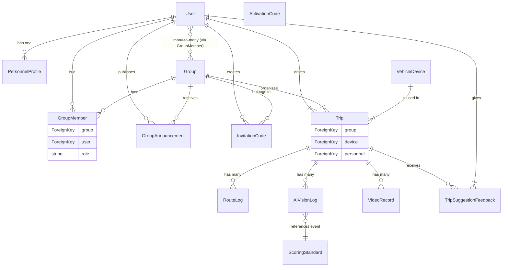

# 專案名稱：AI 駕駛行為分析與車隊管理系統後端模型

## 概述 (Overview)

本文件描述了後端服務的核心 **Django 資料模型**，主要用於支援 **車隊管理、駕駛行為分析** 及 **AI 視覺事件紀錄** 等功能。系統圍繞著 **人員、群組、車機、行程** 等核心實體設計，旨在提供一個結構化的資料基礎來進行數據收集、評分、分析與回饋。

所有模型定義於 `api/models.py` 檔案中。

## 資料庫實體關係圖 (ERD)

此圖表直觀地展示了各個核心資料模型之間的關聯。

## 資料模型結構總覽 (Data Model Structure)

系統模型可分為四大主要模組：

1.  **人員與權限管理 (User & Permission Management)**
    * 管理使用者資料、系統啟用碼、群組與群組內角色。
2.  **系統與公告 (System & Announcement)**
    * 管理系統級和群組級的公告，以及群組邀請機制。
3.  **車輛與行程管理 (Vehicle & Trip Management)**
    * 本系統的核心模組，負責記錄行程細節、地理軌跡、AI 偵測事件、評分標準與影像紀錄。
4.  **回饋 (Feedback)**
    * 用於收集使用者對 AI 建議的意見回饋。

---

## 各模組模型詳解 (Module Details)

### 1. 人員與權限管理
此模組負責所有與使用者、權限及組織結構相關的資料。

| 模型名稱 (Table Name) | 說明 (Description) | 關鍵欄位 (Key Fields) | 關聯 / 備註 |
| :--- | :--- | :--- | :--- |
| **PersonnelProfile** | 擴充 Django 內建 User 模型，儲存人員詳細資料。 | `personnel_number` (人員編號), `phone`, `license_number`, `driving_experience` (駕駛年資), `nfc_card_id` | **OneToOne** to `User` |
| **Group** | 定義使用者群組，用於組織成員和行程。 | `group_number`, `name`, `created_by` | **ManyToMany** to `User` via `GroupMember` |
| **GroupMember** | 群組與使用者之間的中介模型，定義成員角色。 | `group`, `user`, `role` (角色: 成員/管理員) | **ForeignKey** to `Group` & `User` |
| **ActivationCode** | 用於新用戶註冊的系統級啟用碼，可重複使用。 | `code` (自動生成), `max_uses`, `current_uses`, `expires_at` | `code` 邏輯: `MDG-{random_hex}` |

### 2. 系統與公告
此模組處理資訊發布與成員邀請功能。

| 模型名稱 (Table Name) | 說明 (Description) | 關鍵欄位 (Key Fields) | 備註 / 核心邏輯 |
| :--- | :--- | :--- | :--- |
| **SystemAnnouncement** | 平台級公告。 | `announcement_number`, `content`, `is_active` | 面向所有使用者。 |
| **GroupAnnouncement** | 特定群組內部的公告。 | `announcement_number` (自動生成), `group`, `publisher` | `announcement_number` 邏輯：`ANN-{group_id}-{random_hex}` |
| **InvitationCode** | 具時效性、一次性的群組邀請碼。 | `code` (自動生成), `group`, `expires_at`, `is_used` | `code` 邏輯：`secrets.token_hex(4).upper()`；預設 24 小時過期。 |

### 3. 車輛與行程管理 (核心模組)
此為系統的核心，記錄了所有與車輛、行程、駕駛行為相關的數據。

| 模型名稱 (Table Name) | 說明 (Description) | 關鍵欄位 (Key Fields) | 關聯 (Relationship) |
| :--- | :--- | :--- | :--- |
| **VehicleDevice** | 車載設備 (車機) 資料。 | `device_number`, `vehicle_type` | - |
| **Trip** | **核心行程紀錄**，記錄單次行程的整體資訊與評分。 | `trip_number`, `group`, `device`, `personnel`, `score`, `in_car_score`, `out_car_score`, `ai_suggestion`, `total_mileage` | **ForeignKey** to `Group`, `VehicleDevice`, `User` |
| **RouteLog** | 儲存行程中的**地理軌跡資料**。 | `trip`, `timestamp`, `location`, `speed` | **ForeignKey** to `Trip` |
| **ScoringStandard** | 定義 AI 偵測事件的**評分標準**。 | `event_number`, `description`, `deduction_points` (扣分點數) | - |
| **AiVisionLog** | 儲存 AI 偵測到的**具體駕駛事件紀錄**。 | `trip`, `event`, `timestamp`, `event_details`, `confidence_score` | **ForeignKey** to `Trip`, `ScoringStandard` |
| **VideoRecord** | 儲存與行程關聯的**影像紀錄資訊**。 | `video_number` (自動生成), `trip`, `video_url`, `start_time`, `end_time` | **ForeignKey** to `Trip` |

### 4. 回饋
此模組用於建立使用者與系統之間的互動與改進循環。

| 模型名稱 (Table Name) | 說明 (Description) | 關鍵欄位 (Key Fields) | 備註 / 核心邏輯 |
| :--- | :--- | :--- | :--- |
| **TripSuggestionFeedback** | 收集使用者對 AI 行程建議的**回饋**。 | `trip`, `user`, `feedback_type` (1: 有幫助, -1: 沒有幫助), `comment` | **`unique_together = ('trip', 'user')`**：確保單一使用者對單一行程只提交一次回饋。 |

---

## 技術棧 (Technology Stack)

* **後端框架**: Django
* **資料庫 ORM**: Django Models
* **語言**: Python
